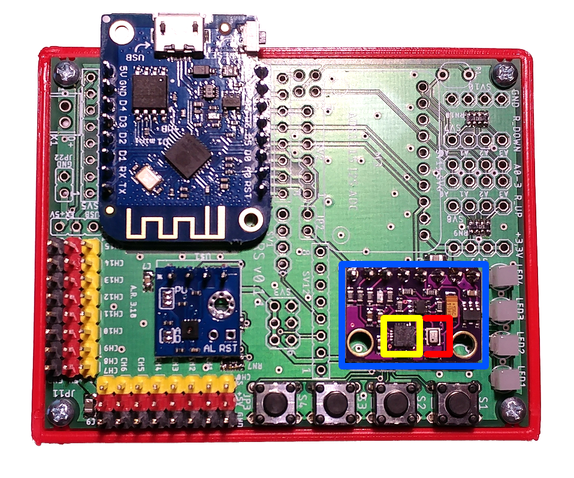
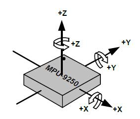
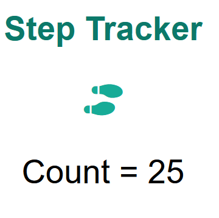

# Pedometer 

## About

The project was developed for course: `Computer Systems (Master's degree, FRI 2022)`

## Hardware
Step tracker is implemented using `ESP8266` microcontroller and `MPU 9520` sensor unit. 

<figure>
<figcaption>Development Board</figcaption>

</figure>

<figure>
<figcaption>MPU9250 axes</figcaption>

</figure>

## Usage
User must define the following 2 marcos, with network credetials

```
#define SSID                "your_ssid"
#define PASS                "your_password"
```

User can access the UI through browser on the local IP. 
Local IP can be view by opening the Serial Monitor in Arduino IDE.

<figure>
<figcaption>User Interface</figcaption>

</figure>

## Report 
Seminar report is available (`step_tracker.pdf`). 
